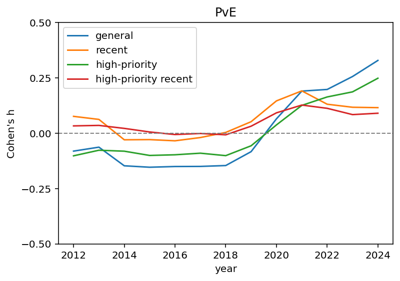
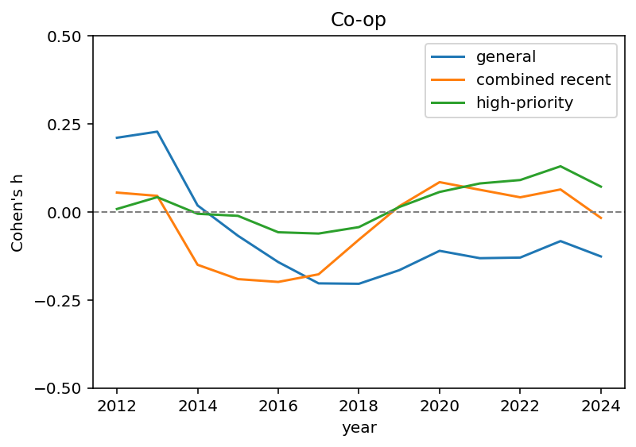

## 🧠 Overview
[](LICENSE)  
This repository contains the code, data, and instructions to reproduce the results from our full paper:  
### 📄 From Fads to Classics — Analyzing Video Game Trend Evolutions through Steam Tags
_[IEEE 2025 Conference on Games](https://cog2025.inesc-id.pt/)_  
Nicolas Grelier, Pullup Entertainment  
[Johannes Pfau](https://nevermindcreations.de/), Utrecht University  
Nicolas Mathieu, Pullup Entertainment  
Stéphane Kaufmann, Pullup Entertainment  
arXiv: [http://arxiv.org/abs/2506.08881](http://arxiv.org/abs/2506.08881)  

---

## 📝 Abstract
> The video game industry deals with a fast-paced, competitive and almost unpredictable market. Trends of genres, settings and modalities change on a perpetual basis, studios are often one big hit or miss away from surviving or perishing, and hitting the pulse of the time has become one of the greatest challenges for industrials, investors and other stakeholders. In this work, we aim to support the understanding of video game trends over time based on data-driven analysis, visualization and interpretation of Steam tag evolutions. We confirm underlying groundwork that trends can be categorized in short-lived _fads_, contemporary _fashions_, or stable _classics_, and derived that the surge of a trend averages at about four years in the realm of video games. After using industrial experts to validate our findings, we deliver visualizations, insights and an open approach of deciphering shifts in video game trends.

---

## 📈 Figures (output curves for example tags)


## 🗂️ Repository Structure
```yaml
├── data/ # Input dataset (Steam tag information of yearly released game titles, as retrieved from https://steamspy.com/api.php)
├── src/ # Source code for experiments
├── results/ # Output figures
├── requirements.txt # Python dependencies
├── LICENSE
├── README.md
└── FromFadsToClassics.pdf # paper PDF
```

## 🚀 Getting Started

### Prerequisites

- Python >= 3.8
- Recommended: Use a virtual environment or Conda.

### Setup

Clone the repo:
```bash
git clone https://github.com/JohannesPfau/SteamTrends.git
cd SteamTrends
```

Create and activate a virtual environment:
```bash
python -m venv env
source env/bin/activate  # or `env\Scripts\activate` on Windows
pip install -r .\requirements.txt
```

### 📊 Running the Code
To reproduce the main results:
```bash
python .\src\main.py
```
Feel free to adapt all parameters in ``main.py`` to personalize your analysis.
